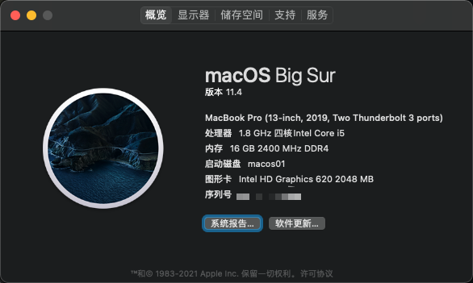

# Opencore 0.6.9 EFI for the Lenovo ThinkPad E580

## Computer configuration

* CPU：Intel Core i5-8250U 1.6GHz
* GPU：Intel UHD 620 Graphics
* RAM：2 x 8GB DDR4-2400MHz
* WIFI：Intel WiFi6 AX200（I replaced the original WiFi card）
* Display：15.6" FHD IPS 1920x1080
* SSD：Western Digital Blue NVMe SSD 1TB

## BIOS Settings

* BIOS version 1.34
* Disable VT-d
* Enable Intel Virtualisation
* Disable Secure Boot

## Not Supported Hardware

* ATI Radeon RX550
* Card Reader
* Following stock NVMe SSDs reported as not supported: Samsung PM981

## Wi-Fi Adapter

You can replace to intel AX series or BCM94352Z, if so you would also need to change the kext.
Intel Wi-Fi Adapter：[OpenIntelWireless itlwm](https://github.com/OpenIntelWireless/itlwm)、[IntelBluetoothFirmware](https://github.com/OpenIntelWireless/IntelBluetoothFirmware)
Brcm  Wi-Fi Adapter：[AirportBrcmFixup](https://github.com/acidanthera/AirportBrcmFixup)、[BrcmPatchRAM](https://github.com/acidanthera/BrcmPatchRAM)

The Ethernet  is working properly, so if you don't have a wireless card to replace, you can use Ethernet temporarily.

